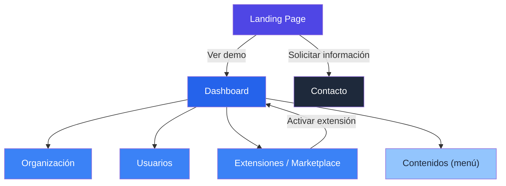
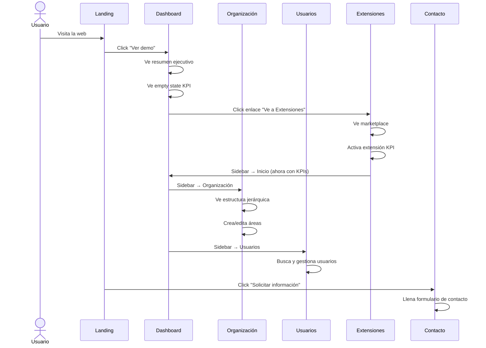

# Documentación del Mockup — Orquestra (Figma)

> Fuente: [Prototipo Figma](https://oasis-wrist-23659520.figma.site/)  
> Fecha de documentación: 2026-02-22  
> Total de vistas: **6 pantallas**

---

## 1. Mapa de Navegación



---

## 2. Design System

### Paleta de Colores

| Token               | Valor       | Uso                                    |
|----------------------|-------------|----------------------------------------|
| `--primary`          | `#2563EB`   | Botones primarios, sidebar activo, logo |
| `--primary-light`    | `#EEF2FF`   | Fondo sidebar hover, fondo app         |
| `--accent-green`     | `#16A34A`   | Estado "Activo", indicadores positivos |
| `--accent-red`       | `#DC2626`   | Botones eliminar, alertas              |
| `--surface`          | `#FFFFFF`   | Tarjetas, contenedores                 |
| `--bg`               | `#F0F4FF`   | Fondo general de la app (azul pálido)  |
| `--text-primary`     | `#0F172A`   | Títulos, texto principal               |
| `--text-secondary`   | `#64748B`   | Subtítulos, descripciones              |
| `--text-muted`       | `#94A3B8`   | Placeholders, texto auxiliar           |
| `--border`           | `#E2E8F0`   | Bordes de tarjetas y tablas            |
| `--cta-dark`         | `#0F172A`   | Botones del marketplace (Activar)      |

### Tipografía

- **Familia**: Sans-serif moderna (Inter o similar)
- **Títulos de página**: ~28px, weight 700 (bold)
- **Subtítulos**: ~16px, weight 400, color `--text-secondary`
- **KPI numbers**: ~36px, weight 700
- **Texto de tabla**: ~14px, weight 400
- **Badges**: ~12px, weight 500, padding 4px 12px

### Espaciado y Radios

| Propiedad          | Valor   |
|--------------------|---------|
| Border radius cards | 12px   |
| Border radius badges | 999px (pill) |
| Padding contenido  | 32px   |
| Gap entre KPI cards | 16px  |
| Sidebar width      | ~240px |

### Iconografía

- **Estilo**: Outlined / Linear (no rellenas)
- **Color**: `--primary` (#2563EB)
- **Tamaño sidebar**: 20px
- **Tamaño cards extensiones**: 40px

---

## 3. Vistas Detalladas

### 3.1 Landing Page

**Propósito**: Página comercial / punto de entrada para prospectos.

#### Layout

```
┌──────────────────────────────────────────────────────┐
│  🔵 Orquestra          Producto  Capacidades  Contacto │ ← Navbar
├──────────────────────────────────────────────────────┤
│                                                        │
│  Convierte la operación       ┌──────────────────┐   │
│  de tu empresa en un          │  wireframe app    │   │
│  sistema medible.             │  (preview)        │   │
│                               └──────────────────┘   │
│  Subtítulo descriptivo                                │
│  [Ver demo]  [Solicitar información]                  │
│                                                        │
├──────────────────────────────────────────────────────┤
│  "Capacidades que se adaptan a tu operación"          │
│  ┌──────────┐ ┌──────────┐ ┌──────────┐              │
│  │Estructura│ │Indicad.  │ │Activación│              │
│  │empresar. │ │KPI       │ │inmediata │              │
│  └──────────┘ └──────────┘ └──────────┘              │
├──────────────────────────────────────────────────────┤
│  "¿Listo para transformar tu operación?"              │
│  [Solicitar información]                               │
├──────────────────────────────────────────────────────┤
│  © 2026 Orquestra. Todos los derechos reservados.     │
└──────────────────────────────────────────────────────┘
```

#### Componentes

| Componente | Detalle |
|---|---|
| **Navbar** | Logo + 3 enlaces de navegación (Producto, Capacidades, Contacto) |
| **Hero** | H1 grande + texto descriptivo + 2 CTAs + mockup decorativo |
| **CTA primario** | "Ver demo" — botón azul `#2563EB`, pill shape |
| **CTA secundario** | "Solicitar información" — botón outline blanco |
| **Cards capacidades** | 3 tarjetas con icono lineal azul + título + descripción |
| **CTA final** | Sección centrada con título + botón azul |
| **Footer** | Copyright centrado, fondo gris claro |

#### Notas

- El fondo general tiene un gradiente azul muy sutil (`#F0F4FF` → blanco)
- La imagen hero es un wireframe estilizado del dashboard (genera confianza visual)
- Las tarjetas de capacidades tienen borde `1px solid #E2E8F0` con `border-radius: 12px`

---

### 3.2 Dashboard (Inicio)

**Propósito**: Resumen ejecutivo post-login. Vista principal de la app.

#### Layout

```
┌─────────┬──────────────────────────────────────────┐
│         │  🏷️ Directivo ▼    ❓  ✉️                │ ← Header
│ SIDEBAR │──────────────────────────────────────────│
│         │  Dashboard                                │
│ Inicio* │  Bienvenido a Orquestra                   │
│ Organiz.│                                           │
│ Usuarios│  ┌────────┐ ┌────────┐ ┌────────┐       │
│ Conteni.│  │Resumen │ │Activid.│ │Estado  │       │
│ Extens. │  │org: 12 │ │24 hoy  │ │100% ✅ │       │
│         │  │148 col.│ │+18%    │ │Sin inc.│       │
│         │  └────────┘ └────────┘ └────────┘       │
│         │                                           │
│         │  Indicadores                              │
│         │  ┌───────────────────────────────────┐   │
│         │  │        📈                          │   │
│         │  │  No hay indicadores configurados   │   │
│         │  │  Ve a Extensiones para activar KPI │   │
│         │  └───────────────────────────────────┘   │
└─────────┴──────────────────────────────────────────┘
```

#### Componentes

| Componente | Detalle |
|---|---|
| **Sidebar** | 5 ítems: Inicio, Organización, Usuarios, Contenidos, Extensiones |
| **Sidebar active** | Fondo azul claro `#EEF2FF`, texto `#2563EB`, icono azul |
| **Header** | Selector de rol "Directivo ▼" + ayuda (?) + mensajes (✉️) |
| **KPI Card 1** | "Resumen organización" — 12 áreas activas, 148 colaboradores, icono documento |
| **KPI Card 2** | "Actividad reciente" — 24 acciones hoy, +18% vs ayer, icono gráfico |
| **KPI Card 3** | "Estado del sistema" — 100% operativo en verde, "Sin incidencias" |
| **Empty State** | Icono gris grande de gráfica + texto + enlace a Extensiones |

#### Notas

- El sidebar ocupa ~240px con fondo blanco y borde derecho sutil
- El logo "🔵 Orquestra" en la esquina superior izquierda es clickeable
- La sección de Indicadores muestra un **empty state** que guía al usuario a activar KPI
- El selector "Directivo" sugiere que hay múltiples perfiles/roles

---

### 3.3 Organización

**Propósito**: Gestión de la estructura jerárquica de la empresa (áreas y departamentos).

#### Layout

```
┌─────────┬──────────────────────────────────────────────┐
│ SIDEBAR │  Organización                 [+ Nueva área] │
│         │  Estructura empresarial y áreas de la empresa│
│         │                                              │
│         │  ┌──────────┐ ┌──────────┐ ┌──────────┐    │
│         │  │Total     │ │Total     │ │Niveles   │    │
│         │  │áreas: 14 │ │empl: 209 │ │jerárq: 4 │    │
│         │  └──────────┘ └──────────┘ └──────────┘    │
│         │                                              │
│         │  Estructura organizacional                   │
│         │  ┌──────────────────────────────────────┐   │
│         │  │ ▼ 📋 Dirección General               │   │
│         │  │   👥 3 empleados  Resp: Roberto Silva │   │
│         │  ├──────────────────────────────────────┤   │
│         │  │ ▶ 📋 Ventas                    ✏️ 🗑️ │   │
│         │  │   👥 24 empleados  Resp: María Gdez  │   │
│         │  ├──────────────────────────────────────┤   │
│         │  │ ▶ 📋 Operaciones               ✏️ 🗑️ │   │
│         │  │   👥 45 empleados  Resp: Carlos Ménd.│   │
│         │  ├──────────────────────────────────────┤   │
│         │  │ ▶ 📋 Recursos Humanos          ✏️ 🗑️ │   │
│         │  └──────────────────────────────────────┘   │
└─────────┴──────────────────────────────────────────────┘
```

#### Componentes

| Componente | Detalle |
|---|---|
| **Botón acción** | "+ Nueva área" — botón negro/oscuro, esquina superior derecha |
| **KPI Cards** | 3 métricas: Total áreas (14), Total empleados (209), Niveles jerárquicos (4) |
| **Tree List** | Lista expandible con flecha ▶/▼ por nivel + icono + datos |
| **Row data** | Nombre área, conteo empleados, responsable asignado |
| **Row actions** | Iconos de editar (✏️) y eliminar (🗑️) al final de cada fila |
| **Indent** | Las sub-áreas están indentadas ~24px respecto al padre |

#### Notas

- Dirección General es el nodo raíz (expandido: ▼), el resto colapsados (▶)
- El "Dirección General" NO tiene botón de eliminar (protegido)
- Los iconos de acción solo aparecen al final de cada fila, no en hover
- Las tarjetas superiores usan el mismo diseño que el Dashboard

---

### 3.4 Usuarios

**Propósito**: CRUD de usuarios con roles, áreas y estados.

#### Layout

```
┌─────────┬────────────────────────────────────────────────────┐
│ SIDEBAR │  Usuarios                         [+ Nuevo usuario]│
│         │  Gestiona los usuarios y sus permisos              │
│         │                                                    │
│         │  ┌──────┐ ┌──────┐ ┌──────┐ ┌──────┐             │
│         │  │Total │ │Activ.│ │Inact.│ │Áreas │             │
│         │  │ 10   │ │ 9 🟢 │ │ 1    │ │ 12   │             │
│         │  └──────┘ └──────┘ └──────┘ └──────┘             │
│         │                                                    │
│         │  🔍 Buscar por nombre, email o área...             │
│         │                                                    │
│         │  ┌─────────────────────────────────────────────┐  │
│         │  │Nombre    │Email          │Tel    │Área│Rol│Est│ │
│         │  ├──────────┼──────────────┼───────┼────┼───┼───┤ │
│         │  │R. Silva  │roberto@..    │600... │DG  │Dir│🟢 │ │
│         │  │M. Gonzál.│maria@..      │600... │Vent│Rsp│🟢 │ │
│         │  │C. Méndez │carlos@..     │600... │Oper│Rsp│🟢 │ │
│         │  │A. Martín.│ana@..        │600... │Prod│Col│🟢 │ │
│         │  │L. Torres │luis@..       │600... │RRHH│Rsp│🟢 │ │
│         │  └─────────────────────────────────────────────┘  │
└─────────┴────────────────────────────────────────────────────┘
```

#### Componentes

| Componente | Detalle |
|---|---|
| **Botón acción** | "+ Nuevo usuario" — mismo estilo que "+ Nueva área" |
| **KPI Cards** | 4 métricas: Total (10), Activos (9 en verde), Inactivos (1), Áreas (12) |
| **Buscador** | Input con icono 🔍, placeholder "Buscar por nombre, email o área..." |
| **Tabla** | 7 columnas: Nombre, Email, Teléfono, Área, Rol, Estado, Acciones |
| **Badge Rol** | Pill badges de color: Directivo (azul), Resp. de área (morado), Colaborador (gris) |
| **Badge Estado** | Pill: Activo (verde), Inactivo (gris) |
| **Acciones fila** | Editar (✏️) + Eliminar (🗑️) |

#### Notas

- Los emails usan dominio `@orquestra.com`
- Los teléfonos son de formato español: +34 600 XXX XXX
- "Usuarios activos" se muestra en color verde para diferenciarlo
- Los badges de rol usan colores distintos para diferenciación visual rápida

---

### 3.5 Extensiones (Marketplace)

**Propósito**: Marketplace de módulos/capacidades que el usuario activa bajo demanda.

#### Layout

```
┌─────────┬──────────────────────────────────────────────┐
│ SIDEBAR │  Capacidades disponibles                     │
│         │  Activa extensiones para ampliar Orquestra   │
│         │                                              │
│         │  ┌──────────┐ ┌──────────┐ ┌──────────┐    │
│         │  │📊 Disp.  │ │📋 Disp.  │ │💬 Disp.  │    │
│         │  │Indicad.  │ │Formulari.│ │Encuestas │    │
│         │  │KPI       │ │          │ │          │    │
│         │  │Mide el   │ │Crea form.│ │Crea enc. │    │
│         │  │desempeño │ │personal. │ │para feed.│    │
│         │  │[ACTIVAR ]│ │[ACTIVAR ]│ │[ACTIVAR ]│    │
│         │  └──────────┘ └──────────┘ └──────────┘    │
│         │                                              │
│         │  ┌──────────┐ ┌──────────┐                  │
│         │  │👥 Prox.  │ │📈 Prox.  │                  │
│         │  │Colaborac.│ │Business  │                  │
│         │  │          │ │Intellig. │                  │
│         │  │Facilita  │ │Análisis  │                  │
│         │  │comunic.  │ │avanzado  │                  │
│         │  │[PROX..  ]│ │[PROX..  ]│                  │
│         │  └──────────┘ └──────────┘                  │
└─────────┴──────────────────────────────────────────────┘
```

#### Componentes

| Componente | Detalle |
|---|---|
| **Card Extensión** | Icono 40px + Badge estado + título + descripción + botón CTA |
| **Badge "Disponible"** | Pill negro/oscuro con texto blanco |
| **Badge "Próximamente"** | Pill gris con texto gris oscuro |
| **Botón "Activar"** | Full-width, fondo negro/oscuro `#0F172A`, texto blanco, bold |
| **Botón "Próximamente"** | Full-width, fondo gris claro, texto gris, deshabilitado |
| **Grid** | 3 columnas arriba (disponibles), 2 columnas abajo (próximamente) |

#### Extensiones Documentadas

| Extensión | Estado | Icono | Descripción |
|---|---|---|---|
| Indicadores KPI | Disponible | 📊 Barras | Mide el desempeño de tu empresa con indicadores personalizados y en tiempo real |
| Formularios | Disponible | 📋 Clipboard | Crea formularios personalizados para recopilar información de tu equipo |
| Encuestas | Disponible | 💬 Chat | Crea y gestiona encuestas para obtener feedback de tu equipo y clientes |
| Colaboración | Próximamente | 👥 Personas | Facilita la comunicación y el trabajo en equipo entre departamentos |
| Business Intelligence | Próximamente | 📈 Tendencia | Análisis avanzado de datos y reportes inteligentes para toma de decisiones |

#### Notas

- El título de la página es "Capacidades disponibles", NO "Extensiones"
- Los botones de "Activar" son de color negro contrastante (no azul primario)
- Las extensiones "Próximamente" están visualmente atenuadas pero visibles

---

### 3.6 Contacto (Solicitar información)

**Propósito**: Formulario de captación de leads / solicitud de demo.

#### Layout

```
┌──────────────────────────────────────────────────────┐
│  🔵 Orquestra                                        │
│  ← Volver                                            │
├──────────────────────────────────────────────────────┤
│                                                      │
│  Solicitar información            ┌──────────────┐  │
│  Completa el formulario...        │Info contacto  │  │
│                                   │📧 contacto@.. │  │
│  ┌──────────────────────────┐    │📞 +34 900...  │  │
│  │ Nombre completo *        │    │📍 Madrid, Esp.│  │
│  │ Empresa *                │    └──────────────┘  │
│  │ Email *                  │    ┌──────────────┐  │
│  │ Mensaje                  │    │Demo personal. │  │
│  │ [Solicitar información]  │    │Agenda una dem.│  │
│  └──────────────────────────┘    └──────────────┘  │
│                                   ┌──────────────┐  │
│                                   │Horario atenc. │  │
│                                   │L-V 9:00-18:00│  │
│                                   └──────────────┘  │
└──────────────────────────────────────────────────────┘
```

#### Componentes

| Componente | Detalle |
|---|---|
| **Layout** | 2 columnas: formulario (60%) + info lateral (40%) |
| **Enlace "← Volver"** | Navegación de retorno a Landing |
| **Campos** | Nombre* , Empresa*, Email*, Mensaje (textarea) |
| **Botón submit** | "Solicitar información" — full-width, fondo negro `#0F172A` |
| **Card info** | Email: contacto@orquestra.com, Tel: +34 900 123 456, Oficina: Madrid |
| **Card demo** | Descripción de demo personalizada |
| **Card horario** | Lunes a Viernes 9:00 – 18:00 |

#### Notas

- Esta vista NO tiene sidebar (es una vista "fuera" de la app)
- Solo navbar superior con logo
- Los campos obligatorios están marcados con asterisco (*)
- El botón de envío es negro (consistente con los CTAs del marketplace)

---

## 4. Patrones de Diseño Clave

### Patrón AppLayout (vistas internas)

```
┌──────────────────────────────────────┐
│ Logo        Header (rol + acciones)  │
├──────────┬───────────────────────────┤
│ Sidebar  │  Contenido principal      │
│ (240px)  │  (flex-grow)              │
│          │                           │
│ Nav items│  H1 + subtítulo           │
│ con icon │  KPI Cards (3-4)          │
│          │  Contenido específico     │
│          │                           │
└──────────┴───────────────────────────┘
```

### Patrón KPI Card

```
┌─────────────────────────┐
│  Título            Icon │  ← 14px, color texto secundario
│  VALOR GRANDE           │  ← 36px, bold, negro
│  Subtítulo              │  ← 14px, color muted
│  👥 Dato adicional      │  ← 14px, con icono
└─────────────────────────┘
```

### Patrón Extension Card

```
┌─────────────────────────┐
│  🔵 Icono    [Badge]    │  ← Icono 40px + estado
│                         │
│  Título                 │  ← 18px, bold
│  Descripción breve      │  ← 14px, muted
│                         │
│  [═══ ACTIVAR ════════] │  ← Botón full-width negro
└─────────────────────────┘
```

### Patrón Table Row (Usuarios)

```
│ 👤 Nombre | 📧 Email | 📞 Tel | Área | [Rol badge] | [Estado badge] | ✏️ 🗑️ │
```

### Patrón Tree Item (Organización)

```
│ ▶ 📋 Nombre Área                                              ✏️ 🗑️ │
│   👥 N empleados   Responsable: Nombre Apellido                      │
```

---

## 5. Comportamientos Interactivos Observados

| Comportamiento | Descripción |
|---|---|
| **Sidebar active state** | El ítem activo tiene fondo `#EEF2FF` y texto/icono `#2563EB` |
| **Empty state contextual** | Dashboard sin KPI muestra placeholder con enlace a Extensiones |
| **Selector de rol** | Dropdown "Directivo ▼" en el header, sugiere cambio de perfil |
| **Tree expand/collapse** | Áreas expandibles con ▶/▼ |
| **Extension activation** | Botones "Activar" vs "Próximamente" con estilos diferenciados |
| **CRUD actions** | Iconos editar/eliminar consistentes en todas las vistas |
| **Navigation flow** | Landing → Dashboard → Sidebar navigation entre vistas |

---

## 6. Resumen de Flujo de Usuario


